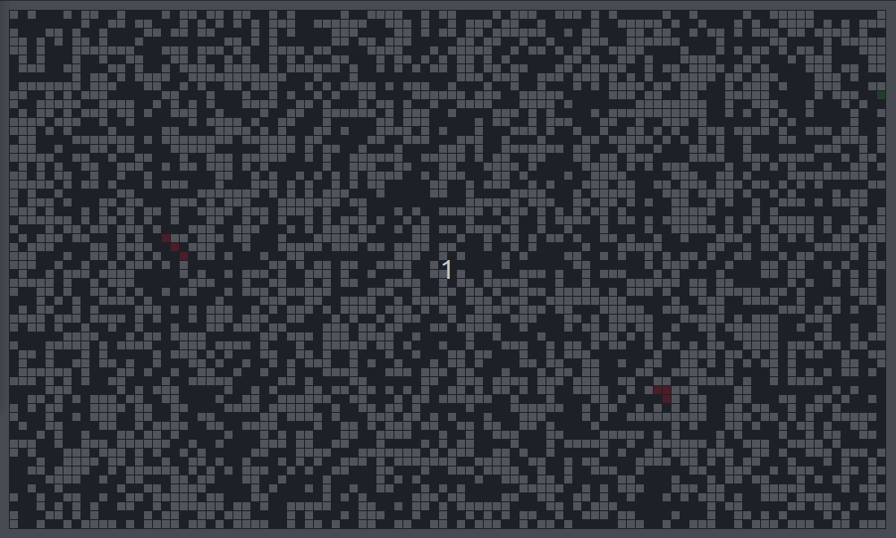

# NotANameServer - Défi 5 - Automates cellulaires

Ma proposition pour le défi sur un weekend, proposé sur **[NotANameServer](https://github.com/NotANameServer/challenges)**.

:o: Pour ce défi, nous devions nous plonger dans le monde des automates cellulaires.

:o: Le défi proposait de mettre à rude épreuve la créativité des plus chevronné·es.

# Ma proposition

Dans un premier temps j'ai réalisé le [Jeu de la vie](https://fr.wikipedia.org/wiki/Jeu_de_la_vie) original avec une interface graphique *(life.py)*.

Ensuite j'ai modifié les règles afin de simuler une contamination des cellules. Les cellules peuvent être dans un état vivant, contaminé, immunisé ou mort. En partant d'un nombre donné de cellule infectées, je simule la diffusion du virus selon les règles suivantes :
- A dead cell with 3 neighbors alive becomes alive
- An alive cell in normal state has a possibility to catch a virus if a neighbor is infected. The more infected neighbors, the more are the chance to become infected.
- An infected cell as a probability to die, to become immune or to stay as it is.
- An immune cell can still get the virus from an infected neighbor and can also lose its immunity. It can also stay as it is.

## Installation

Ce dont vous avez besoin pour executer le projet :
- Python3
- python3-tk
- numpy
